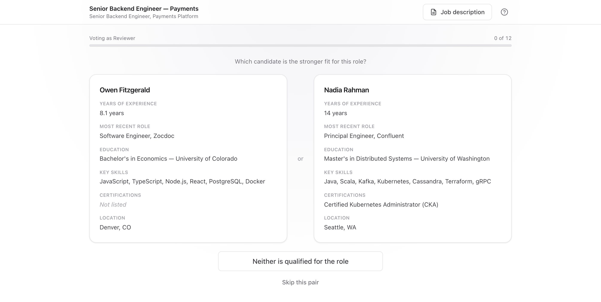
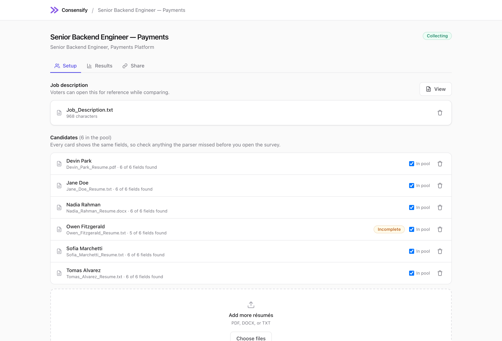
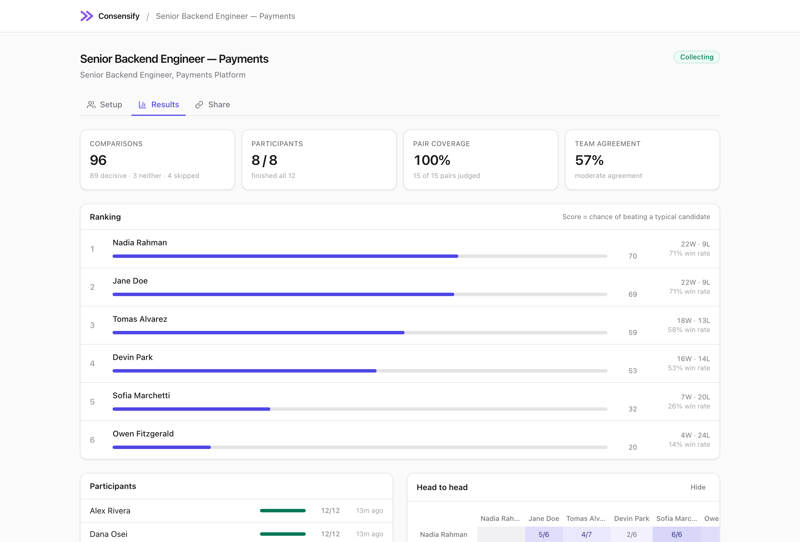

# Consensify

Upload résumés, send your team one link, and they compare candidates two at a time. You get back a ranked shortlist.



## Why pairwise

Scoring a candidate 1 to 10 is hard, and reviewers don't calibrate the same way. Picking between two is easy. Consensify only ever asks the easy question and rebuilds the full ranking from the answers.

## How it works

Create a survey and drop in résumés. PDF, DOCX, and TXT get parsed into a fixed set of fields (years of experience, most recent role, education, key skills, certifications, location). Parsing is rule based, no LLM, so it runs offline and instantly. It gets things wrong often enough that every field is editable before the survey opens.



Then share the link. Whoever opens it types their name and starts comparing. No accounts, no signup.

Both cards show the same fields in the same order, aligned row by row, so a candidate never looks stronger because their résumé happened to parse cleanly. Reviewers can also answer "neither is qualified" or skip a pair they can't call. The job description is one click away, and arrow keys work if you want to move fast.



The dashboard updates live with the ranking, who has finished, how many pairs have been covered, and how much the team actually agrees.

## Scoring

Ranking uses a regularized Bradley-Terry model fit with MM iteration, in `lib/scoring.js`. I went with Bradley-Terry over Elo because it's order independent, so the same set of votes always produces the same ranking. Elo drifts depending on the order votes happen to arrive in. The regularization keeps an undefeated candidate from running off to infinite strength on three lucky wins.

The score on the dashboard is the model's estimate of that candidate's chance of beating a typical candidate, 0 to 100.

"Neither" votes stay out of the model, since they say nothing about which of the two is stronger. They're tracked separately as a disqualification signal.

Pair selection buckets the pairs a reviewer hasn't seen yet by how often they've been judged overall, then picks at random from the least judged bucket. Coverage stays even without the next pair being predictable. Which side a candidate appears on is randomized separately each time, which cancels out side bias.

## Running it

```bash
npm install
npm run seed   # optional demo data
npm run dev
```

Needs Node 22.5+. The database is Node's built in `node:sqlite`, so there's nothing to compile. `npm run seed` builds a demo survey with 6 candidates and 96 simulated votes and prints the dashboard and voting links. `npm run reset` clears it.

## Stack

Next.js (pages router), Tailwind, SQLite. Résumé text comes out of pdf.js and mammoth.

```
lib/db.js            schema and every query
lib/extract.js       document text to comparison fields
lib/scoring.js       Bradley-Terry, Copeland, win rates, agreement
lib/pairing.js       which pair to show next
pages/v/[token].js   the voting link
pages/survey/[id].js setup, results, share
```

## Limits

This is a proof of concept, and a few things are deliberately simple.

Data is local SQLite, so voting links only work for people who can reach your machine. It also can't run on GitHub Pages, since it needs a Node server and a writable database. The screenshots above are the demo. Moving it online means swapping `lib/db.js` for a hosted database, and every query lives in that one file.

There's no auth. Voting links are unguessable, but the dashboard isn't protected.

Parsing is good enough to skip most of the typing and not good enough to trust unread, so check the cards before opening a survey.

Every candidate, résumé, and reviewer name in `samples/` and in the screenshots is made up.
